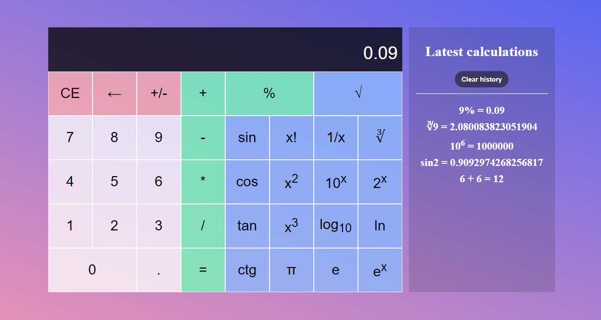

# Calculator Vanilla JavaScript

A simple and pretty calculator written in vanilla JS.

# Features
- basic operations like multiplication, subtract, divide and sum
- special operations like square, trigonometric functions, logarithms, etc.
- keyboard support
- calculations history
- responsive layout for mobile devices

# Getting started
1. Clone this repo
``` 
git clone https://github.com/krzysztofhewelt/Calculator-Vanilla-JavaScript
```
2. Run index.html in your browser

# Used technologies and tools
- HTML
- JavaScript
- CSS
- IDE: VSCode

# License
Distributed under the Apache License 2.0.
